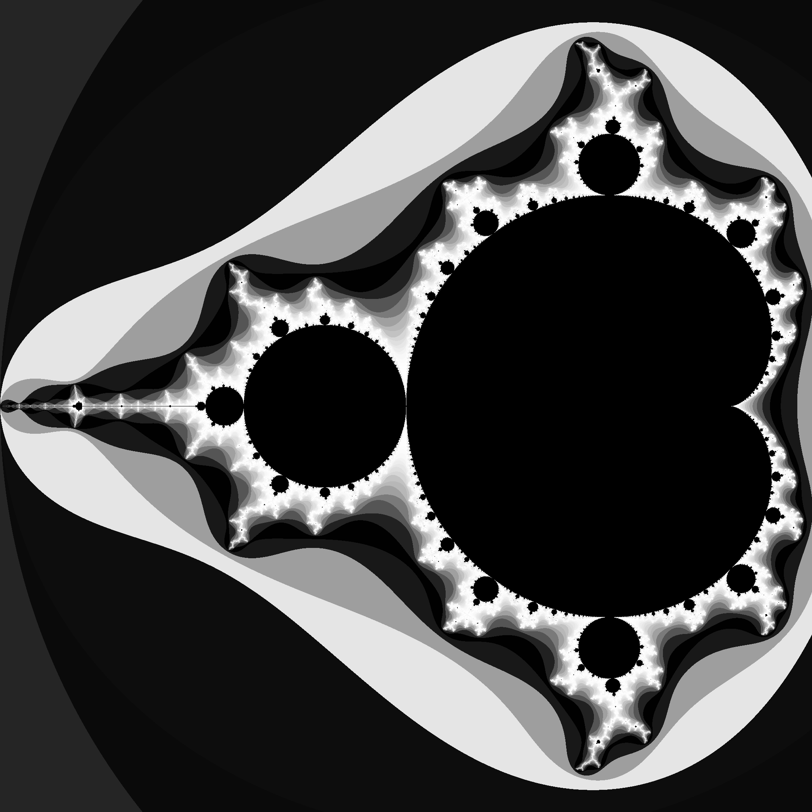

ckormanyos/mandelbrot\
[](https://github.com/ckormanyos/mandelbrot/actions)
==================

ckormanyos/mandelbrot implements a header-only C++ template library for
extended precision Mandelbrot fractal iterations.

It is intended to be used for so-called _deep_ _dives_ involving multiple-precision
floating-point or fixed-point types.

## Design Goals

The following design goals have been incorporated.
  - ckormanyos/mandelbrot is written in header-only C++11, and compatible through C++11, 14, 17, 20.
  - The inner loop performing the work of fractal iterations uses multiple, parallel CPU cores.
  - C++ template design allows for flexible use of any appropriate kind of big-number type.
  - Visualization of the result uses color-stretching techniques combined with the histogram method.
  - Graphical representation uses [Boost.Gil](https://www.boost.org/doc/libs/1_78_0/libs/gil/doc/html/index.html) in combination with the JPEG-6b library (see below).
  - Color schemes can be easily adapted via straightforward creation (or modification) of a skinny derived class.

## Sample Images

### Classic Full Mandelbrot Image

A black-and-white rendition of the well-known, classic full Mandelbrot iteration is shown below.
The image has the following features and parameters.

  - The square image has  pixels.
  - Centered at the point .
  - Uses a half-width of .
  - Computed with  iteratons using the `cpp_dec_float` type from [Boost.Multiprecison](https://www.boost.org/doc/libs/1_78_0/libs/multiprecision/doc/html/index.html) instantiated with  decimal digits of precision.



### Swirly Seahorses and Mini Mandelbrot

A beautiful iteration result showing swirly seahorses and a mini Mandelbrot image
in black-and-white color representation is shown below. The image
has the following features and parameters.

  - The square image has  pixels.
  - Centered at the point .
  - Uses a half-width of .
  - Computed with  iteratons using the `cpp_dec_float` type from [Boost.Multiprecison](https://www.boost.org/doc/libs/1_78_0/libs/multiprecision/doc/html/index.html) instantiated with  decimal digits of precision.


### A Really Deep Dive

My personal best deep dive has a scale of approximately
.
This is a huge magnification factor having a value of approximately
,
(i.e.,

followed by

zeros).

The result of this deep dive iteration is represented by the image below.
It has the the following features and parameters.

  - The square image has  pixels.
  - Centered at the point  (see the code for the full precision).
  - Uses a half-width of .
  - Computed with  iteratons using the `gmp_float` type from [Boost.Multiprecison](https://www.boost.org/doc/libs/1_78_0/libs/multiprecision/doc/html/index.html) instantiated with  decimal digits of precision.


## Using ckormanyos/mandelbrot

ckormanyos/mandelbrot uses configuration files to specify the point,
size and depth of the iterative fractal calculation.
The configuration files are stored in the [mandelbrot/cfg](./mandelbrot/cfg)
directory.

The code responsible for controlling the iterative calculation,
performing color-stretching and writing the output file
is written in a generic, configurable way.

To characterize a new Mandelbrot fractal iteration, simply write
a similar header-configuration-file. Include it in
[test_mandelbrot.cpp](./mandelbrot/test_mandelbrot.cpp) and run the calculation.

Clearly named definitions are used to specify the output file name,
the number of decimal digits of precision needed in the number type of the iteration,
the numbers of pixels and iterations, and the geometric center and half-width
of the magnification region.

Consider, for instance, (as a sample) the configuration file
[mandelbrot_cfg_MANDELBROT_01_FULL.h](./mandelbrot/cfg/mandelbrot_cfg_MANDELBROT_01_FULL.h).

```
  // This is the classic full immage.

  #define MANDELBROT_FILENAME_STRING            "MANDELBROT_01_FULL"

  #define MANDELBROT_CALCULATION_DIGITS10       37
  #define MANDELBROT_CALCULATION_PIXELS_1D      2048UL
  #define MANDELBROT_CALCULATION_ITERATIONS     2000UL

  #define MANDELBROT_POINT_DX_HALF              +1.25L
  #define MANDELBROT_POINT_CENTER_X             -0.75L
  #define MANDELBROT_POINT_CENTER_Y             +0.0L

  #include <mandelbrot/cfg/mandelbrot_cfg.h>
```

## Adaptions of and Notes on jpeg-6b

We use a modified version of jpeg-6b.
It is located [here](./jpeg-6b-2022).
According to license agreement, this work is referred to as
_the_ _Independent_ _JPEG_ _Group's_ _software_.
Please see their [original _README_](./jpeg-6b-2022)
for more information about and licensing terms
of _the_ _Independent_ _JPEG_ _Group's_ _software_.
