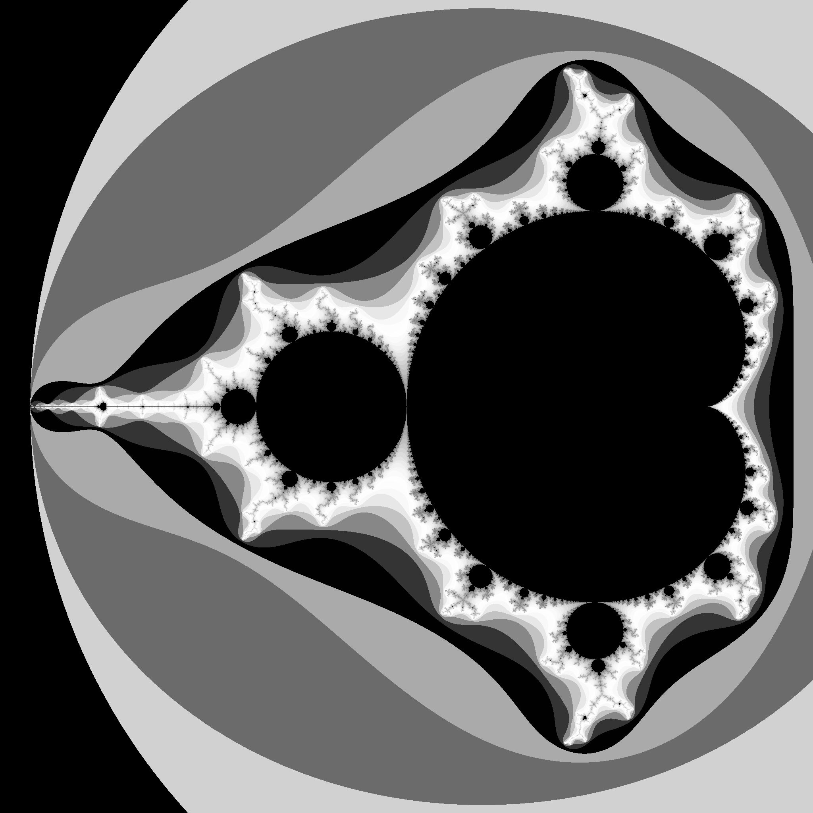
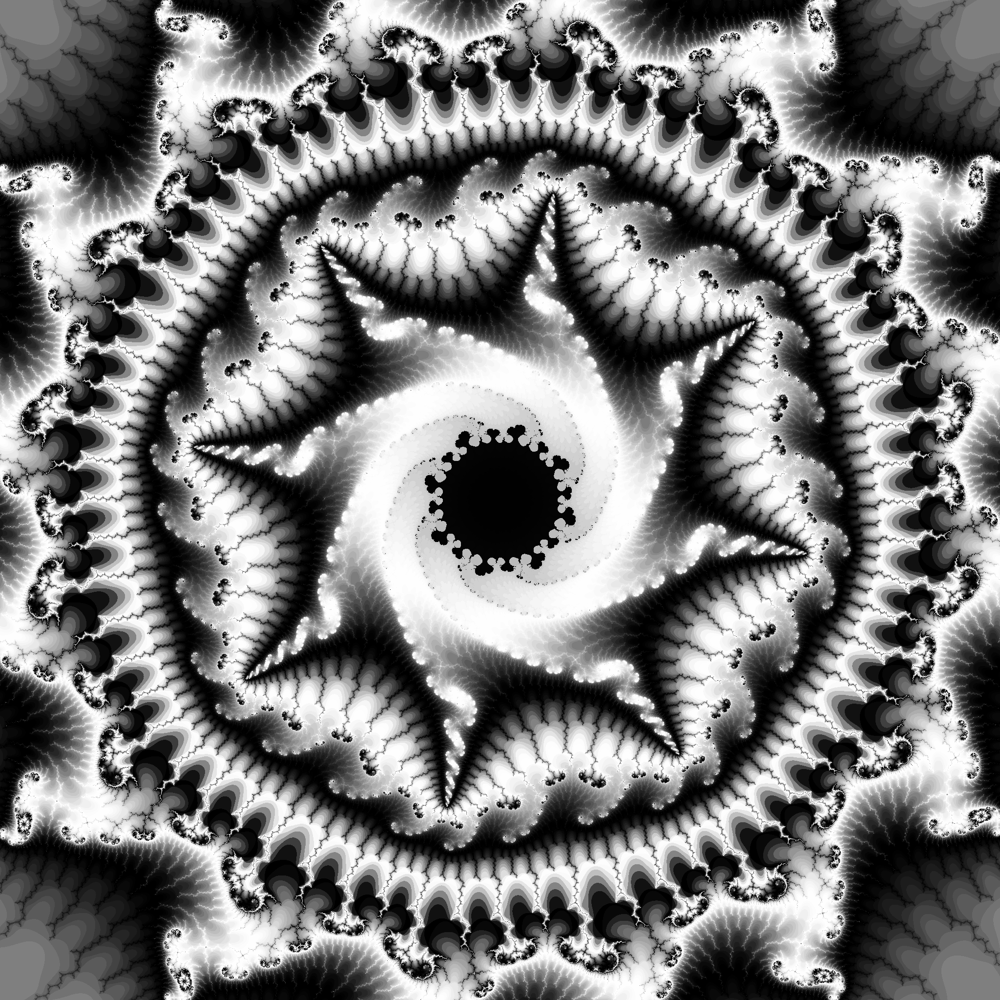
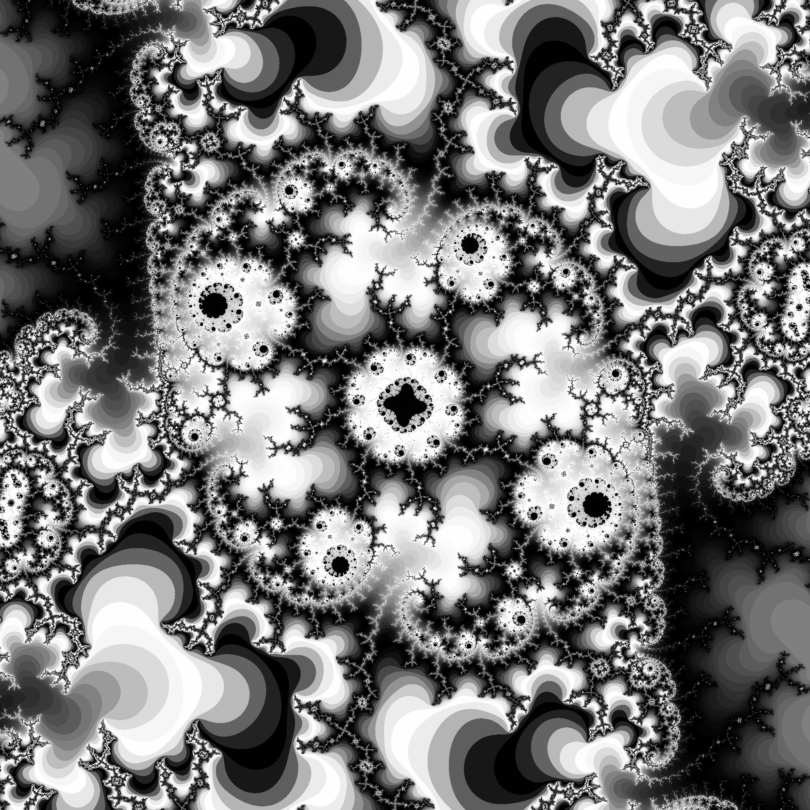

ckormanyos/mandelbrot
==================

<p align="center">
    <a href="https://github.com/ckormanyos/mandelbrot/actions">
        </a>
    <a href="https://github.com/ckormanyos/mandelbrot/actions?query=workflow%3ACodeQL">
        </a>
    <a href="https://github.com/ckormanyos/mandelbrot/issues?q=is%3Aissue+is%3Aopen+sort%3Aupdated-desc">
        </a>
    <a href="https://sonarcloud.io/summary/new_code?id=ckormanyos_mandelbrot">
        </a>
    <a href="https://codecov.io/gh/ckormanyos/mandelbrot">
        </a>
    <a href="https://github.com/ckormanyos/mandelbrot/blob/master/LICENSE_1_0.txt">
        </a>
</p>

The Mandelbrot set consists of the set of points $c$
in the complex plane for which the iteration

$$
z_{n+1} = z_{n}^2 + c{\mbox{,}}
$$

where $z_{0}=0$ and $z~{\in}~{\mathbb{C}}$ remains bounded.

`ckormanyos/mandelbrot` implements a header-only C++ template library
for extended-precision Mandelbrot fractal iterations.
It is intended for _deep_ _dives_ in the Mandelbrot fractal world.

Fractal iterations are carried out with high-precision
floating-point types such as those found in
[`Boost.Multiprecision`](https://www.boost.org/doc/libs/1_86_0/libs/multiprecision/doc/html/index.html).
Also fixed-point types having sufficient precision should work well
(although these have not yet been extensively used or tested in this project).

The interactive companion-program
[`MandelbrotDiscovery`](https://github.com/ckormanyos/mandelbrot/tree/main/MandelbrotDiscovery)
(also in this repo, see below) assists in finding and visualizing interesting points
for deep dives.

## Design

This project uses [`Boost.Multiprecision`](https://www.boost.org/doc/libs/1_86_0/libs/multiprecision/doc/html/index.html)
to implement a high-precision Mandelbrot iteration and visualization.
Graphic file creation uses
[`Boost.Gil`](https://www.boost.org/doc/libs/1_86_0/libs/gil/doc/html/index.html).
Color-stretching in combination with the histogram method
is used for creating vivid images. The default color
scheme uses stretched, amplified and modulated black
and white coloring. The Mandelbrot iteration is carried
out with hardware concurrency with multiple threads.
The multithreading dispatcher uses $(n-1)$
of the available CPU cores that can be found using hardware concurrency.

The following design goals have been incorporated.
  - `ckormanyos/mandelbrot` is written in header-only C++14, and compatible through C++14, 17, 20, 23 and beyond.
  - Support rectangular (including square) images having essentially any size and magnification, provided that the precision of the iteration type is set accordingly.
  - The inner loop that performs the work of fractal iteration uses multiple, parallel CPU cores.
  - C++ template design allows for flexible interchange of any appropriate kind of big-number type in the classes that implement fractal iteration.
  - The iterative scheme is implemented as a flexible run-time polymorphic function. This allows for the implementation and interchange of multiple kinds of iterative methods. These can be specifically optimized for the particular iterative case at hand.
  - Visualization of the result uses color-stretching techniques combined with the histogram method.
  - Graphical representation uses [`Boost.Gil`](https://www.boost.org/doc/libs/1_86_0/libs/gil/doc/html/index.html) in combination with the JPEG-6b library (see [below](#Adaptions-of-and-Notes-on-jpeg-6b)).
  - Imaging also uses specialized versions of the [libpng](http://www.libpng.org/pub/png) and the [zlib](https://www.zlib.net) libraries, in particular [libpng-1.6.44](https://github.com/pnggroup/libpng) and [zlib-1.3.1.1](https://github.com/madler/zlib), with further notes on adaptions still pending.
  - Color schemes can be easily adapted via straightforward creation (or modification) of a skinny derived class.

## Building the Project

### Build on `Win*` with MSVC

  - Locate the solution file `mandelbrot.sln` in the root dierctory.
  - Open the solution file in Visual Studio.
  - Build the desired configuration and run in the usual way.
  - The resulting JPEG image will be placed as a temporary file in the `images\tmp` folder.

### Build and run in the `*nix` shell

The commands are as shown below, where you need to specialize `--boost`, `--my_cc` and `--stdcc` accordingly
(an optional parameter `--ixtra` can be used to set an additional, extra include path, if needed):

```bash
cd mandlebrot
./build_all.sh --boost=../boost-root --my_cc=g++ --stdcc=c++20
mkdir -p images/tmp
./test_mandelbrot.exe
```

In summary, the script [`build_all.sh`](./build_all.sh) is used to:
  - Build the JPEG, ZLIB and PNG libraries with GNUmake.
  - Compile and link [`test_mandelbrot.cpp`](https://github.com/ckormanyos/mandelbrot/blob/main/test/test_mandelbrot.cpp) to obtain the test program `test_mandelbrot.exe`.
  - This build makes and uses its own specialized version of the JPEG-6b library (see [below](#Adaptions-of-and-Notes-on-jpeg-6b)) and does not install or use a standard `*nix` version thereof.
  - This build also makes and uses specialized versions of the [libpng](http://www.libpng.org/pub/png) and the [zlib](https://www.zlib.net) libraries.

Simply go to the [`mandelbrot`](https://github.com/ckormanyos/mandelbrot/tree/main)
directory and run the build shell script [`build_all.sh`](./build_all.sh).
You may need to supply your system's (or your desired local) path to boost.

The build script does not execute the test program (i.e., via `./test_mandelbrot.exe`).
Test program execution must be performed manually. In order to do this,
make the needed output image directory and run `test_mandelbrot.exe` as shown above.

### Optionally Use `gmp_float`

To optionally use `gmp_float`, the [GMP](https://gmplib.org) big-number backend,
instead of `cpp_dec_float`, where both backends are from
[`Boost.Multiprecision`](https://www.boost.org/doc/libs/1_86_0/libs/multiprecision/doc/html/index.html),
simply use [`build_all_gmp.sh`](./build_all_gmp.sh)

```bash
cd mandlebrot
./build_all_gmp.sh --boost=../boost-root --my_cc=g++ --stdcc=c++20
mkdir -p images/tmp
./test_mandelbrot.exe
```

In other words, in `*nix`, it is also possible to optionally
make straightforward use of GMP via `Boost.Multiprecision`'s `gmp_float` backend
(instead of the default `cpp_dec_float` backend).
When doing so, define `-DMANDELBROT_USE_GMP_FLOAT`
on the command line in the compile `test_mandelbrot.cpp` stage.
In this case, you also need to link with `-lgmp` in the link stage.

## Sample Images

Several images are highlighted in the paragraphs below.
Please see the [gallery](./images/gallery) of `ckormanyos/mandelbrot`
for a more comprehensive collection of images.

In these particular images presented from the [gallery](./images/gallery)
of `ckormanyos/mandelbrot`,
we have concentrated on various beautiful iteration results
represented in pure black-and-white/gray-scale tones.

### Classic Full Mandelbrot Image

A black-and-white rendition of the well-known, classic full Mandelbrot iteration is shown below.



This image has the following features and parameters.

  - The square image has $2048 {\times} 2048$ pixels.
  - Centered at the point $(-0.75+i~0.0)$.
  - Uses a half-width of $1.35$.
  - Computed with $2,000$ iteratons using the `cpp_dec_float` type from [`Boost.Multiprecision`](https://www.boost.org/doc/libs/1_86_0/libs/multiprecision/doc/html/index.html) instantiated with $37$ decimal digits of precision.

### Swirly Seahorses and Mini Mandelbrot

A beautiful iteration result showing swirly seahorses and a mini Mandelbrot image
in black-and-white color representation is shown below.


This image has the following features and parameters.

  - The square image has $2048 {\times} 2048$ pixels.
  - Centered at the point $(-0.7453983606667815+i~0.1125046349959942)$.
  - Uses a half-width of $1.76{\times}10^{-12}$.
  - Computed with $2,000$ iteratons using the `cpp_dec_float` type from [`Boost.Multiprecision`](https://www.boost.org/doc/libs/1_86_0/libs/multiprecision/doc/html/index.html) instantiated with $37$ decimal digits of precision.

### A Deep Dive

The following deep dive has a scale of approximately
$2.55{\times}10^{-55}$.
The result of this deep dive iteration is represented by the image below.



This image has the the following features and parameters.

  - The square image has $2048 {\times} 2048$ pixels.
  - Centered at the point $(-1.2951890821477774570170641771856819267{\ldots}+i~0.44093698267832013888090367835626261211{\ldots})$.
  - See the configuration code [mandelbrot_cfg_MANDELBROT_09_DEEP_DIVE_02.h](https://github.com/ckormanyos/mandelbrot/tree/main/mandelbrot/cfg/mandelbrot_cfg_MANDELBROT_09_DEEP_DIVE_02.h) for the full precision of the center point.
  - Uses a half-width of $2.55{\times}10^{-55}$.
  - Computed with $15,000$ iteratons using the `cpp_dec_float` type from [`Boost.Multiprecision`](https://www.boost.org/doc/libs/1_86_0/libs/multiprecision/doc/html/index.html) instantiated with $95$ decimal digits of precision.

### A Deeper Dive

The following deep dive has a scale of approximately
$8.1{\times}10^{-95}$.
The result of this deep dive iteration is represented by the image below.


This image has the the following features and parameters.

  - The square image has $2048 {\times} 2048$ pixels.
  - Centered at the point $(-1.7683830049648722692890015019043698317{\ldots}-i~0.0035564756051580419085635598914228270{\ldots})$.
  - See the configuration code [mandelbrot_cfg_MANDELBROT_60_SATELITE_REGION_01.h](https://github.com/ckormanyos/mandelbrot/tree/main/mandelbrot/cfg/mandelbrot_cfg_MANDELBROT_60_SATELITE_REGION_01.h) for the full precision of the center point.
  - Uses a half-width of $8.1{\times}10^{-95}$.
  - Computed with $60,000$ iteratons using the `cpp_dec_float` type from [`Boost.Multiprecision`](https://www.boost.org/doc/libs/1_86_0/libs/multiprecision/doc/html/index.html) instantiated with $95$ decimal digits of precision.

### A Really Deep Dive

One of my personal best deep dives has a scale of approximately $10^{-311}$.
This is a huge magnification factor having a scale of approximately
$1$ followed by $311$ zeros.
The result of this very deep dive iteration
is represented by the image below.



This image has the the following features and parameters.

  - The square image has $2048 {\times} 2048$ pixels.
  - Centered at the point $(0.3602404434376143632361252444495453084{\ldots}-i~0.6413130610648031748603750151793020665{\ldots})$.
  - See the configuration code [`mandelbrot_cfg_MANDELBROT_20_ZOOM_VERY_DEEP_00.h`](https://github.com/ckormanyos/mandelbrot/tree/main/mandelbrot/cfg/mandelbrot_cfg_MANDELBROT_20_ZOOM_VERY_DEEP_00.h) for the full precision of the center point provided with slightly more than $1,000$ decimal places.
  - Uses a half-width of $4.4 {\times} 10^{-311}$.
  - Computed with $60,000$ iteratons using the `cpp_dec_float` type from [`Boost.Multiprecision`](https://www.boost.org/doc/libs/1_86_0/libs/multiprecision/doc/html/index.html) in combination with low-order perturbative iteration having $24$ decimal digits of precision. The central point of the calculation is instantiated with $365$ decimal digits of precision.

## Using `ckormanyos/mandelbrot`

`ckormanyos/mandelbrot` uses configuration files to specify the point,
size and depth of the iterative fractal calculation.
The configuration files are stored in the
[`mandelbrot/cfg`](https://github.com/ckormanyos/mandelbrot/tree/main/mandelbrot/cfg)
directory.

The code responsible for controlling the iterative calculation,
performing color-stretching and writing the output file
is written in a generic and configurable way.

To characterize a new Mandelbrot fractal iteration, simply write
a header-configuration-file with content similar to that shown below.
Include the configuration file in
[`test_mandelbrot.cpp`](https://github.com/ckormanyos/mandelbrot/tree/main/mandelbrot/test/test_mandelbrot.cpp)
and run the calculation.

Consider as a sample, for instance, the relevant content of the configuration file
[`mandelbrot_cfg_MANDELBROT_01_FULL.h`](https://github.com/ckormanyos/mandelbrot/tree/main/mandelbrot/cfg/mandelbrot_cfg_MANDELBROT_01_FULL.h).

```cpp
  // This is the classic full immage.

  constexpr char MANDELBROT_FILENAME_STRING[]       = "MANDELBROT_01_FULL";

  constexpr int  MANDELBROT_COORD_PNT_DIGITS10      =      32;
  constexpr int  MANDELBROT_ITERATION_DIGITS10      =      32;
  constexpr int  MANDELBROT_CALCULATION_PIXELS_X    =    2048;
  constexpr int  MANDELBROT_CALCULATION_PIXELS_Y    =    2048;
  constexpr int  MANDELBROT_CALCULATION_ITERATIONS  =    2000;

  constexpr char MANDELBROT_POINT_DX_HALF[]         = "+1.35";
  constexpr char MANDELBROT_POINT_DY_HALF[]         = "+1.35";
  constexpr char MANDELBROT_POINT_CENTER_X[]        = "-0.75";
  constexpr char MANDELBROT_POINT_CENTER_Y[]        = "+0.00";

  template<typename CoordPntNumericType, typename IterateNumericType>
  using my_mandelbrot_generator_type = ::ckormanyos::mandelbrot::mandelbrot_generator_trivial<CoordPntNumericType, IterateNumericType>;
```

Clearly named definitions are used to specify:

  - the output file name,
  - the number of decimal digits of precision (in the big-number type used in the iteration),
  - the numbers of pixels and iterations,
  - and the coordinate center and half-width of the magnification region,
  - the iterative method (such as `mandelbrot_generator_trivial` or `mandelbrot_generator_perturbative`),
  - where the dimensions `MANDELBROT_POINT_DX_HALF`, `MANDELBROT_POINT_DY_HALF`, `MANDELBROT_POINT_CENTER_X`, and `MANDELBROT_POINT_CENTER_Y` are provided as character strings, which remain exact even if the magnification scale requires multiple precision,
  - and `MANDELBROT_CALCULATION_ITERATIONS` sets the default maximum number of iterations which can be modified at run time (i.e., for the _Mandelbrot_ _Discovery_ program).

## The $10^{\mbox{\small{51}}}$ Magnification Club

Let's find some proven deep dives!

Discovering the Mandelbrot set leads to fascinating research that is
mathematically complicated. Investigations in this domain offer enriching
findings. Yet it can sometimes be challenging obtain results.
In particular, it can be difficult to find deep dive points within
the infinitely-complex (and complex-valued) Mandelbrot area.
Miniscule coordinates that offer interesting deep dives are
not intuitively easy to guess or find (even with dedicated searches).

In this section, we specifically list several points having proven
deep dives to $10^{51}$ magnification. Once a point is found,
a picture has been created with full $51$-decimal digit precision.
Images are presented in the corresponding links for the points.

Details:
  - The listed points have approximately $54$ decimal digits of precision.
  - Calculations use a half-width of $1.4{\times}10^{-51}$.
  - Iterations are carried out with a big-float representation having $76$ decimal digits of precision.
  - See the table below for these points and links to the corresponding images.

| Name                      | Point $(x + iy)$ | Image |
| ------------------------- | ----------------------------------------------------------------------------------------------------------------------------- | ---------------- |
| `08_DEEP_DIVE_01`         | $-1.295189082147777457017064177185681926706566460884888469217{+ i~0.440936982678320138880903678356262612113214627431396203682}$ | [image](https://github.com/ckormanyos/mandelbrot/tree/main/images/gallery/mandelbrot_MANDELBROT_08_DEEP_DIVE_01_magnify51.jpg)          |
| `20_ZOOM_VERY_DEEP_00`    | $+0.360240443437614363236125244449545308482607807958585750488{- i~0.641313061064803174860375015179302066579494952282305259556}$ | [image](https://github.com/ckormanyos/mandelbrot/tree/main/images/gallery/mandelbrot_MANDELBROT_20_ZOOM_VERY_DEEP_00_magnify51.jpg)     |
| `30_ZOOM_ANOTHER_00`      | $-1.740062382579339905220844167065825638296641720436171866880{+ i~0.028175339779211048992411521144319509687539076742990608570}$ | [image](https://github.com/ckormanyos/mandelbrot/tree/main/images/gallery/mandelbrot_MANDELBROT_30_ZOOM_ANOTHER_00_magnify51.jpg)       |
| `45_SEAHORSE_OTHER_01`    | $-0.745605122368264995520769522753086369510716449777505626833{+ i~0.112859495427252849953537572395520089297826357072986239717}$ | [image](https://github.com/ckormanyos/mandelbrot/tree/main/images/gallery/mandelbrot_MANDELBROT_45_SEAHORSE_OTHER_01_magnify51.jpg)     |

## Deep Dives and Acceleration via Perturbation

Deep dives are mathematically challenging and computationally difficult.
Even when an interesting point can be found, iterative calculations
tend to be hampered by the very large floating-point types needed
to represent the point in the complex plane.

A magnification of $10^{100}$, in classical iteration for instance, requires
a floating-point type having more than $100$ decimal digits of precision, such as $124$ digits.
This is the only way to trivially resolve the minute differences
in the iterations. Huge number calculations are, however, time-consuming
and weigh heavily on CPU resources.

Computation-time of classical iteration (with full precision) scales
with the computational complexity of multiplication of the
underlying big-numbers. This is non-linear. Typical multiplication complexities
are quadratic Order $N^{2}$ for school-multiplciation or
around Order $N^{1.6}$ for higher order multiplication schemes
like Karatsuba. This non-linear increase in complexity is also
compounded by the fact that deeper dives require higher iteration counts.

There are, nonetheless, perturbative schemes that can reduce the width of the
floating-point types used in iterative caluclations. These can significantly
accelerate high-precision deep dives.
One such scheme was contributed by [S-Streulicht](https://github.com/S-Streulicht)
in the [Speed Gain of PR-100](https://github.com/ckormanyos/mandelbrot/pull/100)
effort.

Perturbative schemes are still computationally intensive. But the strong dependence
on the width of the underlying central point is removed. This is traded
for a slightly more complicated iteration scheme and a bit more pre-iterative
preparational effort. The advantages for deep dives can, however, be stark.
The work for deeper and deeper dives scales more or less linearly
instead of quadratically and increases only with iteration count.
This is a very equitable trade.

### Perturbative Algorithm

For this lower-order perturbation expansion, begin with
the core functionality of the original formula

$$
z_{k+1} = z_{k}^2 + c
$$

and perform a perturbative _delta_ transformation on the coordinates.
See also [Deep Zoom Theory: Perturbation](https://mathr.co.uk/blog/2021-05-14_deep_zoom_theory_and_practice.html#a2021-05-14_deep_zoom_theory_and_practice_perturbation).

In other words

$$
z_{k+1}~{\rightarrow}~z_{k+1} + e_{k+1}
$$

$$
z_{k}~{\rightarrow}~z_{k} + e_{k}
$$

$$
c~{\rightarrow}~c + d{\mbox{.}}
$$

Plugging this into the original formula results in

$$
z_{k+1} + e_{k+1} = z_{k}^{2} + c + e_{k}^2 + 2 z_{k} e_{k} + d{\mbox{.}}
$$

Thereby, we replace the original formula with

$$
e_{k+1} = e_{k}^2 + 2 z_{k} e_{k} + d{\mbox{,}}
$$

where the $z_{k}$ are the pre-calculated values.

The transformed coordinates can be iterated with drastically decreased precision
such as $24$ decimal digits. This can result in saved calculation time.

Further details of the perturbative calculation are briefly described in the following.
  - We also evaluate $z_{k+1}+e_{k+1}$ for the escape check. Alternatively it could be sufficient to check only $e_{k}$. If a given $e_{k}$ escapes at some iteration, then the $z_{k}$ are also expected to escape, albeit at a different iteration step.
  - For clarity, we emphasize that the $z_{k}$ are initially calculated with full precision. But they are iterated with low precision such as $24$ decimal digits.
  - $z_{k}$ is calculated for one reference point (i.e., the center of the picture) with high precision and used for the transformation.
  - Constrains on that central point: The number of iterations prior to its escape needs to be higher than those for the orbital points. Interestingly enough, however, the point does necessarily need to be bound.

## Testing and Continuous Integration

A small test program exercises a variety fractal iterations
that can be selected individually at compile-time.
The default configuration uses the
relatively quick-to-calculate _seahorse_ image configured in
[mandelbrot_cfg_MANDELBROT_05_SEAHORSES.h](https://github.com/ckormanyos/mandelbrot/tree/main/mandelbrot/cfg/mandelbrot_cfg_MANDELBROT_05_SEAHORSES.h).

Continuous integration runs on Ubuntu and MacOS with both GCC/clang
and also runs on Windows with MSVC. GCC's run-time
[sanitizers](https://gcc.gnu.org/onlinedocs/gcc/Instrumentation-Options.html)
are also used in CI in order to help assure dynamic quality.
CI uses the develop branch of modular-boost for multiprecision types.

## TODOs

Improvements on the TODO list include (among others) the following.
  - Experiment with (and implement) massive inner loop parallelization via GPU programming.
  - Find/use an acceleration technique (intended to reduce required precision of deep dives) such as orbit perturbation, series expansion, etc.
  - Discover more interesting coordinates for iteration (help wanted).

## Notes on jpeg-6b and its adaptions

We use a modified version of jpeg-6b.
It is located [here](https://github.com/ckormanyos/mandelbrot/tree/main/mandelbrot/jpeg/jpeg-6b-2022).
According to license agreement, this work is referred to as
_the_ _Independent_ _JPEG_ _Group's_ _software_.
Please see their
[original _README_](https://github.com/ckormanyos/mandelbrot/tree/main/mandelbrot/jpeg/jpeg-6b-2022/README)
in its entirety for more information about and licensing terms
of _the_ _Independent_ _JPEG_ _Group's_ _software_.

The following adaptions have been performed.

  - Test/compile only the subset of functions empirically found to be needed for use with [Boost.Gil](https://www.boost.org/doc/libs/1_86_0/libs/gil/doc/html/index.html).
  - Adapt to VS compiler and VS solution workspace (when building with MSVC).
  - Use GNUmake to build the JPEG library (when building on `*nix`).
  - Run the `*.c`/`*.h` files through the [Artistic Style](http://astyle.sourceforge.net/astyle.html) automatic code formatter, using a version of _AStyle_ from somewhere around 2015.
  - Remove several unused preprocessor options such as short names for linkers.
  - Eliminate all uses of `NEED_FAR_POINTERS` and `NEED_SHORT_EXTERNAL_NAMES`.
  - Handle Level-3 warnings found in MSVC.
  - Handle GCC warnings from `-Wall`, `-Wextra`, `-Wpedantic`, `-Wconversion` and `-Wsign-conversion`.

## Mandelbrot Discovery

The
[`MandelbrotDiscovery`](https://github.com/ckormanyos/mandelbrot/tree/main/MandelbrotDiscovery)
program aims to provide semi-automatic assistance
to find interesting points for fractal deep dives.

This project is work in progress and further enhancements are planned.
__Mandelbrot_ _Discovery_ can, however, be used today for successfully
navigating and finding interesting points for deep dives.
